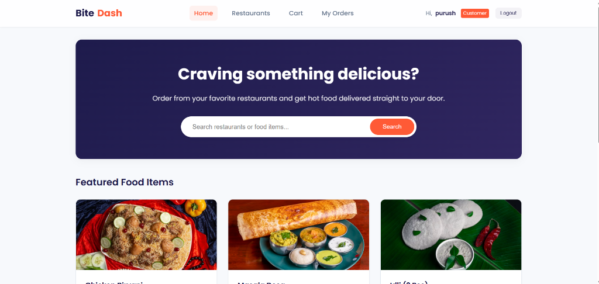
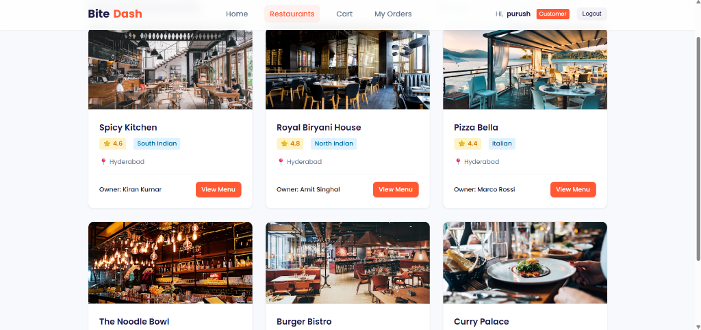
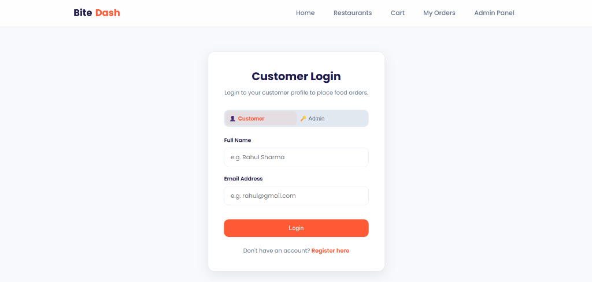
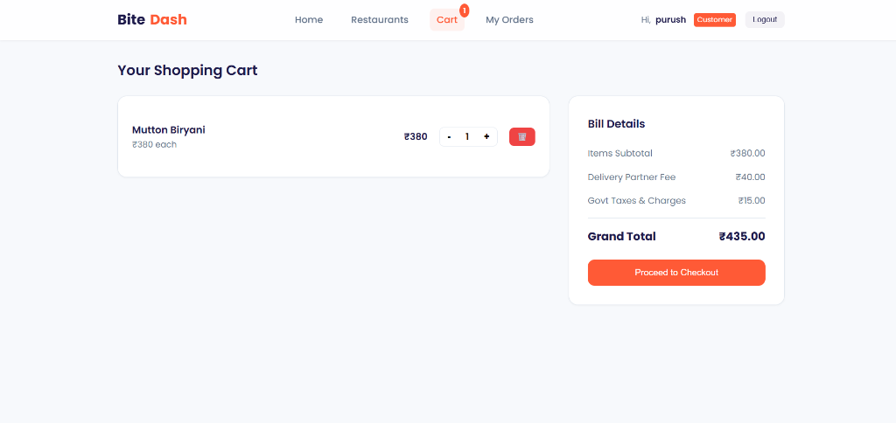
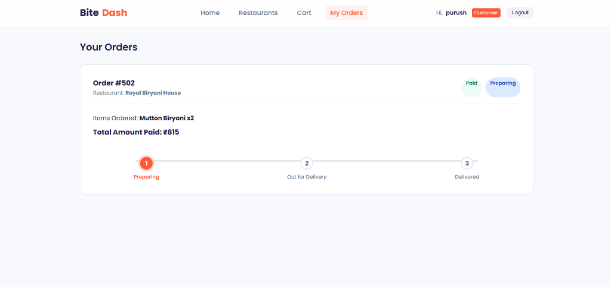
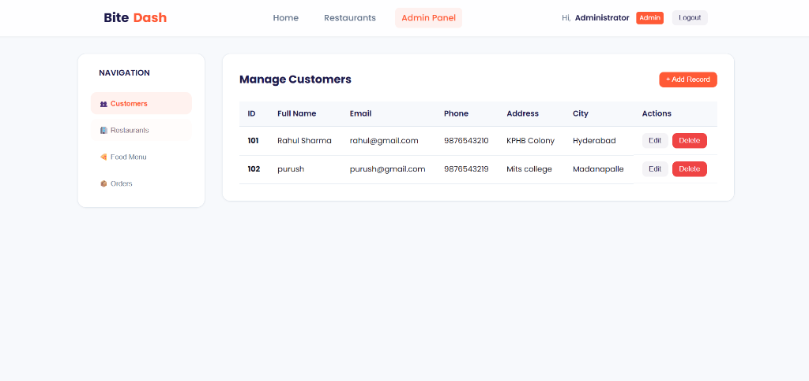

# BiteDash | Food Delivery Application

BiteDash is a full-stack Food Delivery Application built using a **Django REST API** backend with **SQLite** storage and a modern **HTML5 / CSS3 / ES6 JavaScript** frontend. 

Customers can search for restaurants, browse menus, add food items to their cart, place orders, and track delivery status on an interactive timeline. Admins can manage all records (Customers, Restaurants, Menu Items, and Orders) directly from the unified Admin Dashboard.

---

## Technical Stack
- **Frontend:** HTML5, CSS3 (with responsive layout and custom animations), Vanilla ES6 JavaScript, Fetch API
- **Backend:** Django 6.0+, Django Function-Based Views, Django CORS Headers
- **Database:** SQLite 3

---

## Folder Structure

```text
FoodDeliveryApp/
│
├── Backend/
│   ├── __init__.py
│   ├── settings.py      # CORS, Hosts, and app configurations
│   ├── urls.py          # Routing for 20 CRUD endpoints
│   ├── wsgi.py
│   ├── asgi.py
│   ├── db.py            # SQLite database initializer, seed data, & helper queries
│   └── views.py         # 20 Function-Based views handling REST API operations
│
├── Frontend/
│   ├── index.html       # Landing page (Navbar, Search, Listings, Features)
│   ├── login.html       # Customer Login Form
│   ├── register.html    # Customer Registration Form
│   ├── restaurants.html # Restaurant Listing with search & cuisine filters
│   ├── menu.html        # Menu listing for a restaurant with qty selector & Add to Cart
│   ├── cart.html        # Interactive cart with live subtotal/tax/delivery calculation
│   ├── orders.html      # Order tracking with interactive delivery status timeline
│   ├── dashboard.html   # Admin dashboard for full CRUD management
│   ├── style.css        # Premium custom stylesheet with variables and transitions
│   └── script.js        # DOM bindings & Fetch API integrations with backend
│
├── manage.py            # Django project entrypoint
├── test_apis.py         # Automated validation script for all 20 REST API endpoints
└── README.md            # Project documentation (this file)
```

---

## Application Screenshots

Here are the visual representations of the BiteDash frontend application pages:

### 🏠 1. Home Landing Page
Beautiful home page with an interactive search bar, search-by-cuisine cards, and a grid of popular featured dishes:


### 🏢 2. Restaurant Directory Page
Listings of all pre-seeded top-rated dining spots featuring custom tags, cuisine categories, ratings, and locations:


### 👤 3. Customer & Admin Login Page
Clean, centralized login container with tabs to switch between Customer profiles and Admin control panels:


### 🛒 4. Interactive Shopping Cart Page
Interactive cart showing item breakdown, quantity selectors, live bill calculations (subtotal, delivery partner fee, taxes), and checkout controls:


### 🚚 5. Order Tracking Timeline Page
Order history page showing a visual, responsive delivery tracking timeline matching order states (`Preparing` ➔ `Out for Delivery` ➔ `Delivered`):


### 📊 6. Unified Admin Control Panel
Unified management control panel allowing administrators to perform real-time CRUD operations on Customers, Restaurants, Food Items, and Orders:


---

## Running the Project Locally

### 1. Start the Backend Server
From the root directory, start the Django development server:
```bash
python manage.py runserver
```
The server will run on `http://127.0.0.1:8000`.

*Note: On startup, the database is automatically created in `db.sqlite3` and seeded with default sample data (Rahul Sharma, Spicy Kitchen, Chicken Biryani, Cart, and Order) if the tables are empty.*

### 2. Run the Frontend
Simply open `Frontend/index.html` in any web browser. 

Since CORS is fully configured in the backend settings, the local frontend files will successfully communicate with the Django backend APIs.

---

## Automated API Testing
We have included a comprehensive test script `test_apis.py` to programmatically verify all 20 API endpoints.
While the Django server is running, execute:
```bash
python test_apis.py
```
This will run through the complete CRUD life cycles for Customers, Restaurants, Food Items, Cart Items, and Orders.

---

## API Endpoints List (20 CRUD APIs)

### Customer Management (Module 1)
| Method | Endpoint | Description |
| :--- | :--- | :--- |
| `POST` | `/customers/add/` | Register a new customer profile |
| `GET` | `/customers/` | List all customer profiles |
| `PUT` | `/customers/update/<id>/` | Edit/Update customer profile info |
| `DELETE` | `/customers/delete/<id>/` | Delete a customer profile |

### Restaurant Management (Module 2)
| Method | Endpoint | Description |
| :--- | :--- | :--- |
| `POST` | `/restaurants/add/` | Add a new restaurant |
| `GET` | `/restaurants/` | List all restaurants |
| `PUT` | `/restaurants/update/<id>/` | Edit/Update restaurant details |
| `DELETE` | `/restaurants/delete/<id>/` | Delete a restaurant |

### Food Menu Management (Module 3)
| Method | Endpoint | Description |
| :--- | :--- | :--- |
| `POST` | `/foods/add/` | Add a food item |
| `GET` | `/foods/` | List all food items |
| `PUT` | `/foods/update/<id>/` | Update food item details & availability |
| `DELETE` | `/foods/delete/<id>/` | Delete a food item |

### Cart Management (Module 4)
| Method | Endpoint | Description |
| :--- | :--- | :--- |
| `POST` | `/cart/add/` | Add an item to the shopping cart |
| `GET` | `/cart/` | Get all cart items |
| `PUT` | `/cart/update/<id>/` | Update cart item quantity |
| `DELETE` | `/cart/delete/<id>/` | Remove an item from the cart |

### Order Management (Module 5)
| Method | Endpoint | Description |
| :--- | :--- | :--- |
| `POST` | `/orders/add/` | Create a new food order |
| `GET` | `/orders/` | List all orders |
| `PUT` | `/orders/update/<id>/` | Update order details (payment & delivery status) |
| `DELETE` | `/orders/delete/<id>/` | Delete an order |

---

## Implemented Bonus Features
1. **Restaurant Search & Filters:** Dynamic live filtering of restaurants by name, location, and cuisine.
2. **Food Category Filter:** Categorized menu buttons (e.g. Starters, Main Course, Desserts) for clean browsing.
3. **Live Cart Total Calculation:** Real-time billing calculations (Subtotal, Delivery Fee, Taxes, and Grand Total).
4. **Responsive Mobile Design:** Tailored CSS Grid & Flexbox layouts adapting gracefully to mobile screens.
5. **Order Tracking Timeline:** Multi-step visual tracking timeline reflecting delivery progress (`Preparing` ➔ `Out for Delivery` ➔ `Delivered`).